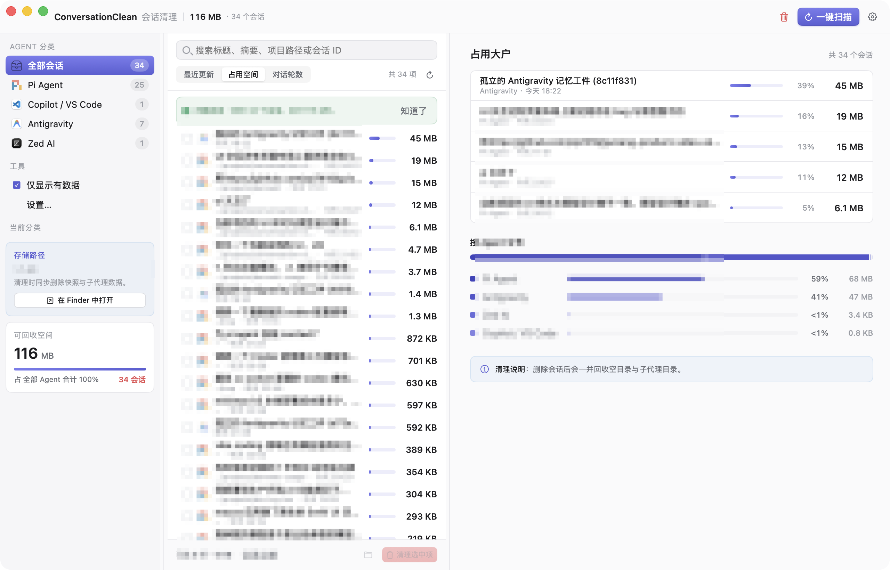

# ConversationClean (macOS)

基于 Swift 6 + SwiftUI 构建的 macOS 原生应用，用于扫描并清理本机各类 AI 编码 Agent / IDE 遗留的会话数据。



<sub>真实运行截图，会话标题 / 项目路径 / 会话 ID 等内容已做马赛克处理。</sub>

---

## 🌟 项目特性

- **15 款 Agent 全覆盖**：统一 `AgentScanner` 协议接入 CLI Agent（Claude Code、Codex、Pi Agent、Cline、Roo Code、Continue.dev、OpenViking、Aider、Zed AI、OpenHands）与 VS Code 系 IDE（VS Code Chat、Cursor、Windsurf、Trae、Antigravity）。
- **双层索引原子清理**：对同时维护「会话文件 + SQLite 索引」的 Agent（VS Code 系 `state.vscdb`、Pi Agent context-mode），删除会话时同步清理索引，避免幽灵会话残留。
- **全自绘 UI**：隐藏标题栏 + 手搓三栏（`ContentView`），红黄绿浮在自有背景上。**零系统 UI 控件**——列表、勾选框、按钮、分段器、搜索框、空态、开关全部手绘（`DrawnControls.swift`），只保留 `Button` / `TextField` 作为交互原语并在系统剥掉外观。视觉 100% 可控，不受 macOS 版本控件改版影响。
- **设计系统 token 化**：色彩、间距、圆角、排版集中在 `Theme.swift`。8pt baseline grid、圆角 6/8/10pt、正文 13pt（macOS 真实值，非 iOS 的 17pt），视图里不允许出现颜色与字号字面量。
- **三栏表面梯**：侧栏 / 列表 / 详情栏分属四级不同底色，不再是三块同色白板拼贴。
- **可拖拽三栏**：两条分隔条可拖动并记忆列宽（`@AppStorage`），上限随窗口宽度动态收窄，缩窗口不会把三栏挤变形。
- **键盘可达**：⌘R 扫描、⌘Delete 清理、⌘F 聚焦搜索、↑↓ 移动选中、Esc 逐级清空（先清搜索词，再清勾选）。自绘列表自己补齐了系统 `List` 自带的键盘导航。
- **体积优先的信息层级**：清理工具里「多大」比「叫什么」重要，所以体积数字的视觉重量**高于**会话标题。数据可视化用同 hue 的靛蓝明度阶梯（可区分但不成彩虹），深浅色均已配降级值。
- **清晰的 MVVM 架构**：`Models/` 数据模型、`ViewModels/` 状态管理、`Views/` 界面组件。
- **并发扫描**：`AgentScanService` 通过 `withTaskGroup` 并发调度全部扫描器。
- **标准 Xcode 工程**：自带完整的 `ConversationClean.xcodeproj` 与共享构建 Scheme。
- **App Sandbox**：预置标准 `.entitlements` 权限配置。

---

## 📁 目录结构

```text
conversation-clean/
├── .gitignore                                  # macOS / Xcode 专用忽略规则
├── README.md                                   # 项目说明文档
├── ConversationClean.xcodeproj/                # Xcode 工程与 Scheme 配置
├── design-demos/                               # UI 设计稿（HTML，可交互）+ 方向定档
│   ├── ui-a-precision.html                     # ✓ 锁定方向：精密密度（Linear 系）
│   ├── ui-b-material.html                      # 备选：材质呼吸（Apple HIG 系）
│   ├── ui-c-volumetric.html                    # 备选：体积优先（DaisyDisk 系）
│   └── direction-approved.md                   # 三方向初稿记录 + 用户选择原话
├── scripts/
│   ├── run_tests.sh                            # 扫描器验证套件：编译 + 运行
│   └── tests/                                  # 按 Agent 家族拆分的测试用例
│       ├── TestSupport/
│       │   ├── TestRunner.swift                # 断言收集、控制台输出、套件汇总
│       │   ├── TestCase.swift                  # 用例上下文（自动携带测试名）
│       │   ├── Fixtures.swift                  # 目录 / 文件 / SQLite 夹具构造助手
│       │   └── TestRegistry.swift              # 用例注册表与 @main 入口
│       ├── ClaudeCodeTests.swift               # 各 Agent 的 real / mock 用例
│       ├── CodexTests.swift
│       ├── DeletionTests.swift                 # 删除与字节统计验证
│       ├── ClineTests.swift · RooContinueTests.swift
│       ├── PiAgentTests.swift · PiAgentContextModeTests.swift
│       ├── UnifiedScanTests.swift              # 多 Agent 并发统一扫描
│       ├── VSCodeChatTests.swift · CursorTests.swift
│       ├── WindsurfTraeTests.swift · AntigravityTests.swift
│       ├── VSCDBIndexSyncTests.swift           # state.vscdb 索引同步
│       └── OpenVikingTests.swift · AiderTests.swift · ZedTests.swift · OpenHandsTests.swift
└── ConversationClean/                          # 源代码主目录
    ├── ConversationCleanApp.swift              # App 启动入口与窗口生命周期
    ├── ContentView.swift                       # 根视图 (NavigationSplitView)
    ├── Models/
    │   └── ConversationItem.swift              # 会话数据模型与枚举
    ├── ViewModels/
    │   └── CleanViewModel.swift                # 状态与业务逻辑 ViewModel
    ├── Views/
    │   ├── Theme.swift                         # 设计系统 token：色彩/间距/圆角/排版
    │   ├── DrawnControls.swift                 # 自绘控件库：按钮/勾选框/分段器/搜索框/空态
    │   ├── SidebarView.swift                   # 侧边栏：分类导航 + 可回收空间体检卡 + 存储路径
    │   ├── ConversationListView.swift          # 自绘会话列表 + 搜索/排序 + 批量操作栏
    │   ├── OverviewView.swift                  # 详情栏未选中态：占用大户 Top5 + Agent 分布
    │   ├── DetailView.swift                    # 详情栏选中态：会话元数据与操作
    │   ├── CleanConfirmSheet.swift             # 清理前二次确认：收益/分布/容量预测
    │   ├── SettingsView.swift                  # 偏好设置面板（自绘开关与分组）
    │   └── AgentIconView.swift                 # 15 款 Agent 品牌标记
    ├── Core/                                   # 跨扫描器共享基建
    │   ├── Formatting.swift                    # 1024 进制体积/时间/路径格式化
    │   ├── AgentScannerProtocol.swift          # 扫描器协议 + FileSizeHelper
    │   ├── AgentScanService.swift              # 并发调度与聚合
    │   ├── DateParsing.swift                   # 进程级共享 ISO8601 解析
    │   ├── SQLite/
    │   │   └── VSCDBHelper.swift               # state.vscdb 索引读写
    │   └── FileSystem/
    │       └── DirectoryCleaner.swift          # 空目录清理
    ├── Scanners/                               # 按存储形态分层的扫描器
    │   ├── CLIAgents/                          # 以 JSONL / JSON 会话文件为主
    │   │   ├── ClaudeCodeScanner.swift · CodexScanner.swift
    │   │   ├── PiAgentScanner.swift            # 协议实现与预索引
    │   │   ├── PiAgentScanner+Parsing.swift · +ContextMode.swift · +ACPSessionMap.swift
    │   │   ├── ClineScanner.swift · RooCodeScanner.swift · ContinueScanner.swift
    │   │   └── OpenVikingScanner.swift · AiderScanner.swift · ZedScanner.swift · OpenHandsScanner.swift
    │   └── VSCodeFamily/                       # 共享 state.vscdb 索引形态
    │       ├── VSCodeChatScanner.swift
    │       ├── CursorScanner.swift             # 协议实现
    │       ├── CursorScanner+JSONL.swift · +StateDatabase.swift · +DirectoryScan.swift
    │       └── WindsurfScanner.swift · TraeScanner.swift · AntigravityScanner.swift
    ├── Assets.xcassets/                        # 图标与配色资源
    └── ConversationClean.entitlements          # 沙盒与权限声明
```

---

## 🚀 快速上手

### 1. 使用 Xcode 打开

直接双击工程文件或在终端执行：

```bash
open ConversationClean.xcodeproj
```

在 Xcode 中选择目标设备为 **My Mac**，按下快捷键 `Cmd + R` 即可运行。

### 2. 命令行编译

```bash
xcodebuild -scheme ConversationClean -configuration Debug build
```

### 3. 运行扫描器验证套件

```bash
./scripts/run_tests.sh
```

套件会针对每个扫描器执行两类验证：

- **real 用例（READ-ONLY）**：扫描本机真实存在的 Agent 数据目录，仅读取与解析，不修改任何文件。
- **mock 用例**：在临时目录构造夹具（含 mock `state.vscdb` / SQLite 索引），验证扫描、字节统计与删除后的索引同步。

全部断言通过时退出码为 `0`，否则为 `1` 并列出失败断言。

---

## 🛠️ 技术要求

- **macOS**：14.0 (Sonoma) 及以上
- **Xcode**：15.0+ / 16.0+
- **Swift**：5.9+ / 6.0+
